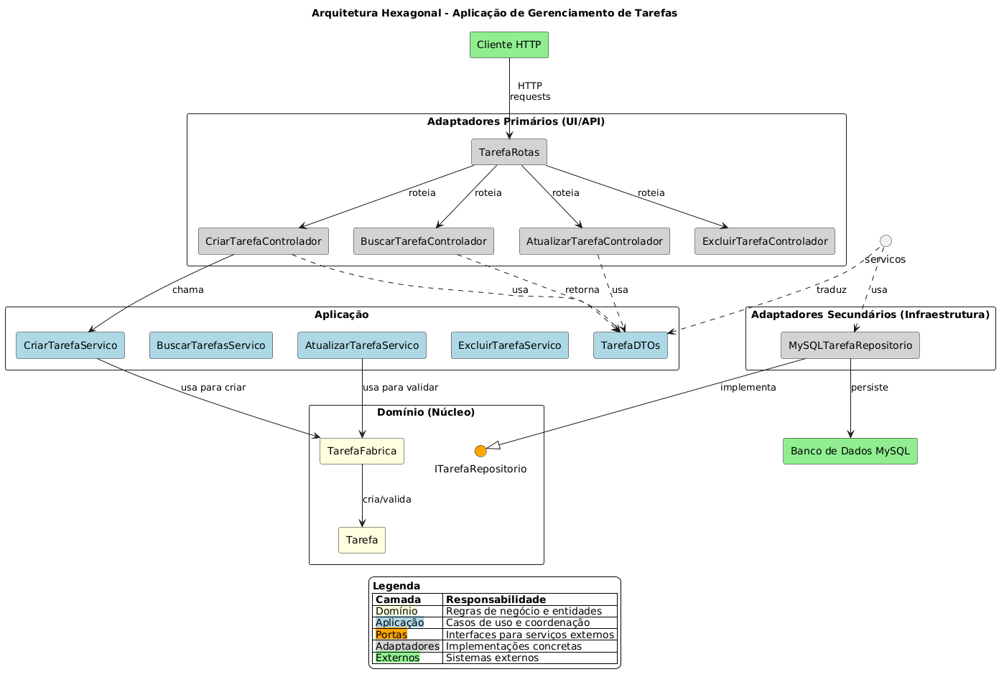

# App de Tarefas - CRUD com Arquitetura Hexagonal

Este projeto consiste em uma aplicação CRUD (Create, Read, Update, Delete) para gerenciamento de tarefas, desenvolvida para demonstrar a aplicação de conceitos de Programação Orientada a Objetos (POO), Arquitetura Hexagonal (Portas e Adaptadores) e boas práticas de desenvolvimento de software.

## Índice

- [Arquitetura do Sistema](#arquitetura-do-sistema)
- [Lógica do Sistema](#lógica-do-sistema)
- [Responsabilidades e Padrões de Projeto](#responsabilidades-e-padrões-de-projeto)
- [Modularização e Estrutura de Pastas](#modularização-e-estrutura-de-pastas)
- [Instalação e Execução](#instalação-e-execução)
- [Principais Classes e Funções](#principais-classes-e-funções)
- [Exemplos de Uso do CRUD](#exemplos-de-uso-do-crud)
- [Testes e Demonstração](#testes-e-demonstração)
- [Boas Práticas e Conceitos de POO](#boas-práticas-e-conceitos-de-poo)
- [Documentação da API](#documentação-da-api)
- [Conclusão](#conclusão)

## Arquitetura do Sistema



### Explicação da Arquitetura

A arquitetura adotada foi a **Arquitetura Hexagonal** (Portas e Adaptadores), também conhecida como "Ports & Adapters". Esta arquitetura divide o sistema em três camadas principais:

- **Domínio (Núcleo)**: Contém a lógica de negócio pura, entidades e regras.
- **Aplicação**: Orquestra os casos de uso e coordena as operações do domínio.
- **Adaptadores**: Conecta o sistema com o mundo exterior (banco de dados, API HTTP, etc.).

### Justificativa da Escolha

Escolhemos a Arquitetura Hexagonal pelos seguintes motivos:

- **Isolamento da Lógica de Negócio**: O domínio fica protegido e independente de tecnologias externas.
- **Testabilidade**: Facilita a criação de testes unitários pois permite a substituição de adaptadores por mocks.
- **Flexibilidade Tecnológica**: Permite trocar tecnologias externas (como o banco de dados) sem impactar o domínio.
- **Manutenibilidade**: Código mais limpo e organizado, com responsabilidades bem definidas.
- **Evolução Independente**: Permite que diferentes partes do sistema evoluam em ritmos diferentes.

## Lógica do Sistema

### Funcionamento do CRUD Passo a Passo

#### Create (Criar Tarefa)
1. O cliente envia uma requisição POST para `/api/tarefas` com os dados da tarefa.
2. O controlador (`CriarTarefaControlador`) recebe a requisição HTTP.
3. Os dados são validados pela `TarefaFabrica`.
4. A fábrica cria uma instância válida da entidade `Tarefa`.
5. O serviço de aplicação invoca o repositório para persistir a tarefa.
6. O repositório MySQL insere os dados no banco.
7. A resposta é enviada ao cliente com o status 201 e os dados da tarefa criada.

#### Read (Buscar Tarefas)
1. O cliente solicita tarefas via GET para `/api/tarefas` ou `/api/tarefas/:id`.
2. O controlador correspondente processa a requisição.
3. O serviço de aplicação invoca o repositório para buscar as tarefas.
4. O repositório consulta o banco de dados MySQL.
5. Os dados são convertidos para entidades do domínio.
6. A resposta é enviada ao cliente com o status 200 e os dados das tarefas.

#### Update (Atualizar Tarefa)
1. O cliente envia uma requisição PUT para `/api/tarefas/:id`.
2. O controlador (`AtualizarTarefaControlador`) valida a requisição.
3. O serviço busca a tarefa existente pelo ID.
4. A `TarefaFabrica` valida os dados de atualização.
5. A entidade `Tarefa` é atualizada através de seus setters.
6. O repositório persiste as alterações no banco de dados.
7. A resposta é enviada ao cliente com o status 200 e os dados atualizados.

#### Delete (Excluir Tarefa)
1. O cliente envia uma requisição DELETE para `/api/tarefas/:id`.
2. O controlador (`ExcluirTarefaControlador`) processa a requisição.
3. O serviço invoca o repositório para excluir a tarefa.
4. O repositório executa o comando DELETE no banco de dados.
5. A resposta é enviada ao cliente com o status 204 (No Content).

### Fluxo de Dados e Interações

O fluxo de dados no sistema segue uma direção clara, com interfaces bem definidas:

- Os controladores dependem dos serviços de aplicação.
- Os serviços de aplicação dependem das interfaces de repositório e do domínio.
- O domínio não depende de nenhuma outra camada.
- Os repositórios implementam as interfaces definidas no domínio.

## Responsabilidades e Padrões de Projeto

### Responsabilidades das Classes e Módulos

#### Domínio
- **Entidade Tarefa**: Encapsula os dados e comportamentos de uma tarefa.
- **Interface ITarefaRepositorio**: Define o contrato para persistência de tarefas.
- **TarefaFabrica**: Responsável pela criação e validação de tarefas.
- **ErroAplicacao**: Representa erros de negócio estruturados.
- **Valores (StatusTarefa, PrioridadeTarefa)**: Definem tipos específicos do domínio.

#### Aplicação
- **Serviços (como CriarTarefaServico)**: Orquestram os casos de uso específicos.
- **DTOs**: Definem estruturas de transferência de dados entre camadas.

#### Adaptadores
- **Controladores**: Traduzem requisições HTTP em chamadas para serviços.
- **Repositórios (como MySQLTarefaRepositorio)**: Implementam a persistência concreta.
- **Rotas**: Mapeiam URLs para controladores.

### Padrões de Projeto Aplicados

- **Repository**: Isola a lógica de acesso a dados e permite que o domínio trabalhe com abstrações ao invés de implementações concretas. Implementado através da interface `ITarefaRepositorio` e da classe `MySQLTarefaRepositorio`.

- **Factory**: Centraliza a criação de objetos complexos, garantindo sua consistência. Implementado na classe `TarefaFabrica` que encapsula a lógica de criação e validação de tarefas.

- **DTO (Data Transfer Object)**: Usado para transferir dados entre camadas, especialmente entre a API e a aplicação. Implementado nas interfaces de transferência como `CriarTarefaDTO`.

- **Dependency Injection**: Utilizado para fornecer dependências às classes, em vez de criá-las internamente. Implementado no arquivo `container.ts` que configura as dependências.

- **Adapter**: Usado para adaptar interfaces externas à interface esperada pelo domínio. Implementado nos controladores e nos repositórios.

## Modularização e Estrutura de Pastas

### Organização do Código

O projeto segue uma estrutura de pastas que reflete a Arquitetura Hexagonal:

```
backend/
├── src/
│   ├── dominio/
│   │   ├── entidades/         # Tarefa.ts
│   │   ├── valores/           # StatusTarefa.ts, PrioridadeTarefa.ts
│   │   ├── portas/            # ITarefaRepositorio.ts
│   │   ├── fabricas/          # TarefaFabrica.ts
│   │   └── erros/             # ErroAplicacao.ts
│   │
│   ├── aplicacao/
│   │   ├── servicos/          # CriarTarefaService.ts, etc.
│   │   ├── dtos/              # TarefaDTO.ts
│   │   └── mapeadores/        # TarefaMapper.ts
│   │
│   ├── adaptadores/
│   │   ├── controladores/     # CriarTarefaControlador.ts, etc.
│   │   ├── repositorios/      # MySQLTarefaRepositorio.ts
│   │   ├── rotas/             # tarefaRotas.ts
│   │   └── db/                # conexao.ts
│   │
│   ├── bootstrap/
│   │   └── container.ts       # Composição de dependências
│   │
│   ├── config/
│   │   ├── swagger.ts
│   │   └── timezone.ts
│   │
│   ├── compartilhado/
│   │   └── data/              # dateOnly.ts
│   │
│   └── index.ts               # Ponto de entrada
│
├── package.json
└── tsconfig.json

frontend/
├── src/
│   ├── componentes/
│   ├── servicos/
│   ├── utils/                 # formatarData.ts
│   └── ...
└── ...
```

### Lógica por Trás da Estrutura

A estrutura de pastas segue o princípio da Separação de Responsabilidades e reflete as camadas da Arquitetura Hexagonal:

- As pastas de primeiro nível (`dominio`, `aplicacao`, `adaptadores`) representam as camadas arquiteturais.
- Dentro de cada camada, as subpastas agrupam elementos com responsabilidades semelhantes.
- A direção das dependências sempre aponta para dentro (adaptadores → aplicação → domínio).
- Elementos do domínio estão isolados no centro, protegidos de influências externas.
- A pasta `bootstrap` mantém o código de inicialização separado da lógica de negócio.

Esta organização facilita:
- Encontrar código relacionado rapidamente.
- Entender a arquitetura apenas olhando a estrutura de pastas.
- Manter a separação de responsabilidades.
- Aplicar alterações isoladas em camadas específicas.

## Instalação e Execução

### Opção 1: Com Docker (Recomendado)

Este método é o mais simples, pois gerencia o backend e o banco de dados MySQL automaticamente.

**Importante**: Se você já tem uma instância MySQL rodando na porta 3306, terá que parar esse serviço antes de usar o Docker, ou modificar a porta no arquivo `docker-compose.yml`.

1. **Clone o repositório**:
   ```bash
   git clone https://github.com/Jhonzim/gerenciador-tarefas-hexagonal.git
   cd "Pasta criada"
   ```

2. **Suba os contêineres do Docker**:
   ```bash
   docker-compose up -d
   ```

3. **Acesse a aplicação**:
   - Frontend: http://localhost:3000
   - Backend API: http://localhost:5000

### Opção 2: Manualmente (com MySQL existente)

Use esta opção se você já tem MySQL rodando na sua máquina.

#### Configurar o Banco de Dados

1. Conecte-se à sua instância do MySQL existente:
   ```bash
   mysql -u root -p
   ```

2. Crie um banco de dados e um usuário para a aplicação:
   ```sql
   CREATE DATABASE tarefas_db;
   CREATE USER 'tarefas_user'@'localhost' IDENTIFIED BY 'tarefas_password';
   GRANT ALL PRIVILEGES ON tarefas_db.* TO 'tarefas_user'@'localhost';
   FLUSH PRIVILEGES;
   ```

#### Configurar e Rodar o Backend

1. Navegue até a pasta do backend:
   ```bash
   cd backend
   ```

2. Crie o arquivo de variáveis de ambiente:
   ```bash
   cp .env.example .env
   ```

3. Edite o arquivo `.env` com os dados da sua conexão MySQL:
   ```
   PORT=5000
   DB_HOST=localhost
   DB_PORT=3306
   DB_USER=tarefas_user
   DB_PASSWORD=tarefas_password
   DB_DATABASE=tarefas_db
   ```

4. Instale as dependências e inicie o servidor:
   ```bash
   npm install
   npm run dev
   ```

   O backend estará rodando em http://localhost:5000

#### Configurar e Rodar o Frontend

**Importante**: Verificar se o backend está rodando na mesma porta especificada no arquivo [Api - Front End](./frontend/src/servicos/api.ts).

1. Em outro terminal, navegue até a pasta do frontend:
   ```bash
   cd frontend
   ```

2. Instale as dependências e inicie a aplicação:
   ```bash
   npm install
   npm start
   ```

   O frontend estará disponível em http://localhost:3000

## Principais Classes e Funções

### Domínio
- **Tarefa**: Entidade central que representa uma tarefa com propriedades como título, descrição, status, prioridade e datas.
- **TarefaFabrica**: Cria e valida instâncias de Tarefa, garantindo sua integridade.
- **ITarefaRepositorio**: Interface que define operações de persistência para tarefas.

### Aplicação
- **CriarTarefaServico**: Serviço responsável por coordenar a criação de uma nova tarefa.
- **AtualizarTarefaServico**: Serviço para atualizar tarefas existentes.
- **BuscarTarefasServico**: Serviço para recuperar tarefas do repositório.
- **ExcluirTarefaServico**: Serviço para remover tarefas.

### Adaptadores
- **MySQLTarefaRepositorio**: Implementa ITarefaRepositorio usando MySQL.
- **CriarTarefaControlador**: Processa requisições HTTP para criar tarefas.
- **montarTarefaRotas**: Configura as rotas Express para o CRUD de tarefas.

## Exemplos de Uso do CRUD

### Criar Tarefa (POST /api/tarefas)
```json
// Requisição
POST /api/tarefas
Content-Type: application/json

{
  "titulo": "Estudar Arquitetura Hexagonal",
  "descricao": "Compreender os conceitos de Portas e Adaptadores",
  "status": "pendente",
  "prioridade": "alta",
  "dataVencimento": "2025-04-15"
}

// Resposta (201 Created)
{
  "id": 1,
  "titulo": "Estudar Arquitetura Hexagonal",
  "descricao": "Compreender os conceitos de Portas e Adaptadores",
  "status": "pendente",
  "prioridade": "alta",
  "dataCriacao": "2025-03-10T14:30:00.000Z",
  "dataAtualizacao": "2025-03-10T14:30:00.000Z",
  "dataVencimento": "2025-04-15"
}
```

### Buscar Todas as Tarefas (GET /api/tarefas)
```json
// Requisição
GET /api/tarefas

// Resposta (200 OK)
[
  {
    "id": 1,
    "titulo": "Estudar Arquitetura Hexagonal",
    "descricao": "Compreender os conceitos de Portas e Adaptadores",
    "status": "pendente",
    "prioridade": "alta",
    "dataCriacao": "2025-03-10T14:30:00.000Z",
    "dataAtualizacao": "2025-03-10T14:30:00.000Z",
    "dataVencimento": "2025-04-15"
  },
  // ... outras tarefas
]
```

### Buscar Tarefa por ID (GET /api/tarefas/:id)
```json
// Requisição
GET /api/tarefas/1

// Resposta (200 OK)
{
  "id": 1,
  "titulo": "Estudar Arquitetura Hexagonal",
  "descricao": "Compreender os conceitos de Portas e Adaptadores",
  "status": "pendente",
  "prioridade": "alta",
  "dataCriacao": "2025-03-10T14:30:00.000Z",
  "dataAtualizacao": "2025-03-10T14:30:00.000Z",
  "dataVencimento": "2025-04-15"
}
```

### Atualizar Tarefa (PUT /api/tarefas/:id)
```json
// Requisição
PUT /api/tarefas/1
Content-Type: application/json

{
  "status": "em_andamento",
  "descricao": "Compreender os conceitos de Portas e Adaptadores e implementar um exemplo"
}

// Resposta (200 OK)
{
  "id": 1,
  "titulo": "Estudar Arquitetura Hexagonal",
  "descricao": "Compreender os conceitos de Portas e Adaptadores e implementar um exemplo",
  "status": "em_andamento",
  "prioridade": "alta",
  "dataCriacao": "2025-03-10T14:30:00.000Z",
  "dataAtualizacao": "2025-03-10T15:45:00.000Z",
  "dataVencimento": "2025-04-15"
}
```

### Excluir Tarefa (DELETE /api/tarefas/:id)
```
// Requisição
DELETE /api/tarefas/1

// Resposta (204 No Content)
```

## Testes e Demonstração

### Como Testar o CRUD

#### Através da Interface Web
A maneira mais intuitiva de testar o CRUD é através da interface web disponível em http://localhost:3000 após iniciar o frontend.

#### Através do Swagger
Com o backend em execução, acesse a documentação interativa Swagger:

http://localhost:5000/api/docs

O Swagger permite executar todas as operações CRUD diretamente pela interface, além de fornecer documentação detalhada dos endpoints.

#### Usando Ferramentas de API
Você também pode testar a API usando ferramentas como Postman, Insomnia ou cURL:

```bash
# Criar tarefa
curl -X POST http://localhost:5000/api/tarefas \
  -H "Content-Type: application/json" \
  -d '{"titulo":"Estudar POO","descricao":"Revisar encapsulamento","status":"pendente","prioridade":"media"}'

# Listar tarefas
curl http://localhost:5000/api/tarefas

# Buscar tarefa específica
curl http://localhost:5000/api/tarefas/1

# Atualizar tarefa
curl -X PUT http://localhost:5000/api/tarefas/1 \
  -H "Content-Type: application/json" \
  -d '{"status":"em_andamento"}'

# Excluir tarefa
curl -X DELETE http://localhost:5000/api/tarefas/1
```

### Demonstração
Durante a apresentação do projeto, serão demonstradas todas as operações CRUD:

- Criação de tarefas com diferentes prioridades e prazos
- Listagem de todas as tarefas
- Busca de tarefas específicas por ID
- Atualização de status e outros campos
- Exclusão de tarefas
- Tratamento de erros (ex: tentar atualizar uma tarefa inexistente)

## Boas Práticas e Conceitos de POO

### Encapsulamento, Herança, Polimorfismo e Abstração

#### Encapsulamento
- **Implementação**: A classe `Tarefa` utiliza propriedades privadas (`private props`) e fornece getters/setters controlados.
- **Benefício**: O estado interno é protegido contra alterações indevidas. Por exemplo, a `dataAtualizacao` é automaticamente atualizada quando uma propriedade é modificada.

#### Abstração
- **Implementação**: A interface `ITarefaRepositorio` define operações abstratas como `criar()`, `buscarTodos()` sem especificar como são implementadas.
- **Benefício**: O domínio pode trabalhar com repositórios sem conhecer os detalhes de implementação.

#### Polimorfismo
- **Implementação**: Diferentes implementações de `ITarefaRepositorio` podem ser usadas (MySQL, em memória, etc.) sem alterar o código do domínio.
- **Benefício**: Facilita testes e adaptação a diferentes tecnologias de persistência.

#### Herança (Limitada neste projeto)
- **Implementação**: Hierarquia de erros, onde `ErroAplicacao` estende `Error`.
- **Benefício**: Permite tratamento diferenciado para erros de aplicação vs. erros do sistema.

### Tratamento de Erros e Validação de Dados

#### Validação de Dados
A validação ocorre em múltiplas camadas:
- **TarefaFabrica**: Valida regras de negócio (ex: título não vazio, tamanho máximo).
- **Controladores**: Validam formato básico e tipos dos dados de entrada.
- **Entidade**: Reforça invariantes durante a modificação de estado.
- **Banco de Dados**: Restrições adicionais de integridade.

#### Tratamento de Erros
- **ErroAplicacao**: Classe personalizada para erros de negócio com status HTTP e detalhes.
- **Middleware de Erro**: Captura e formata erros de forma consistente para o cliente.
- **Try/Catch nos Controladores**: Garantem que nenhum erro passe despercebido.
- **Logs de Erro**: Erros não tratados são registrados no console para depuração.

### Estratégias de Verificação do Sistema
- **Validações Preventivas**: Detecção antecipada de problemas (ex: inputs inválidos).
- **Erros Informativos**: Mensagens de erro claras que auxiliam na correção.
- **Documentação Swagger**: Permite verificar se a API está conforme a especificação.
- **Logs**: Registro de atividades importantes para diagnóstico.
- **Transações de Banco de Dados**: Garantem consistência nas operações de dados.

## Documentação da API

A API do backend é documentada utilizando Swagger. Com o backend em execução, acesse a documentação interativa através do seguinte endereço:

http://localhost:5000/api/docs

O Swagger fornece:
- Listagem completa de endpoints
- Descrição dos parâmetros e corpo das requisições
- Modelos de dados
- Interface para testar os endpoints diretamente no navegador

## Conclusão

Este projeto demonstra a aplicação prática de conceitos de POO e arquitetura de software em um CRUD. A Arquitetura Hexagonal proporciona uma clara separação de responsabilidades, facilitando a manutenção e testabilidade do código.

O uso consistente de padrões como Repository e Factory, juntamente com os princípios de encapsulamento e abstração, resultou em um sistema modular e extensível que pode facilmente evoluir para incorporar novos requisitos.

Características destacadas:
- **Baixo acoplamento**: Camadas bem definidas com dependências unidirecionais
- **Alta coesão**: Classes com responsabilidades únicas e bem definidas
- **Testabilidade**: Fácil substituição de componentes por mocks para testes
- **Documentação**: API documentada e código com responsabilidades claras
- **Validações robustas**: Múltiplas camadas de validação para garantir integridade

